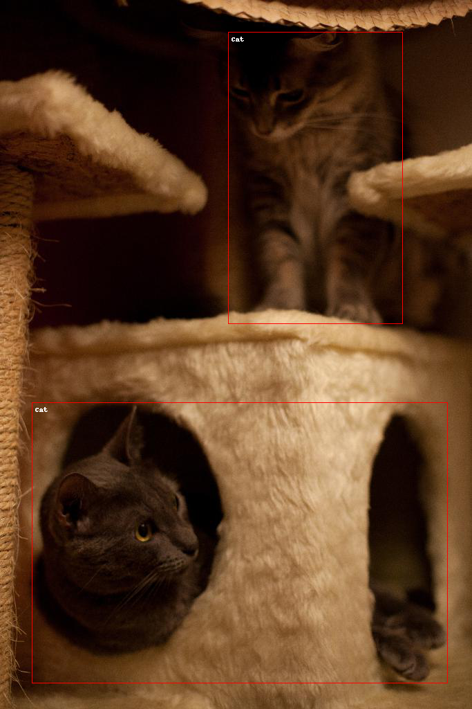
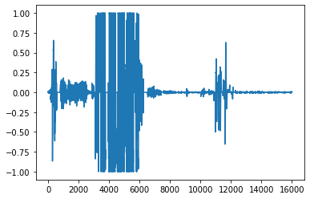
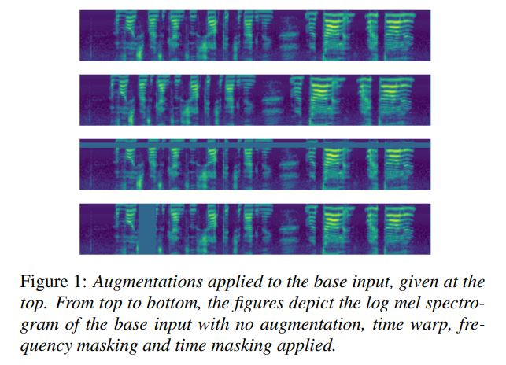

# BrainHack - Today I Learnt 2021 (TIL2021)

## Team 200 Success Team Members
- Kai Jie   
- Nicholas   
- Siew Yeng    
- Mianna    
- Kyrin   

## Result
Our team made it into the finalist as we achieved Top 8 in this competition.

## Synopsis of the Challenge
It is the year 2055. Surveillance has become ubiquitous to our society, to the point where animals :cat::dog2::bird::chicken::snake: have become widely used as surveillance vessels via cybernetic augmentations. However, we have reason to believe in the existence of an unknown group that has been exploiting these animals to wreak havoc upon society, with increasing reports of people having their personal details or items stolen under mysterious circumstances.Your team has been tasked to build visual and audio classification models, in order to identify animals in various environments, and to take in commands in the field. It is up to you, as cadets of the TIL Institute, to set up countermeasures against these rogue surveillance animals. Being able to visually detect nearby animals would be a good first step in ascertaining suspicious behavior from these potential targets.   

**Teams will train models to progress through a mix of 6 Computer Vision and Audio Processing tasks of increasing difficulty. Tasks will be unlocked as you clear the challenges. You will be scored based on the effectiveness of your models for each challenge, and the best-scoring teams would be given prizes.**  

During the 2-day hackathon, you will have to **decide if you would like to push for a higher score for a challenge, or to do well enough to be able to complete all the challenges. May the best teams win!**    

## Team 200 Success Test Set Accuracy Results
Challenge 1 Computer Vision -> 60.062%    
Challenge 2 Speech Classification -> 91.667%    
Challenge 3 Computer Vision -> 61.168%  
Challenge 4 Speech Classification -> 65.074%  
Challenge 5 Computer Vision -> 52.352%  
Challenge 6 Speech Classification -> 67.809%  
  
The hyperparameters of all of our 6 models are in the hyperparameters.pdf file.   
  
## Challenge 1 - Computer Vision
Object detection task to predict the classes and the bounding box of the objects   
Number of classes: 5  
Classes: cat, dog, chicken, bird, snake   
   

## Challenge 2 - Speech Classification
Speech Classification task to predict a spoken word   
Number of classes: 13   
Classes: zero, one, two three, four, five, six, seven, eight, nine, bird, falcon, snake  
  
   
   
## Challenge 3 - Computer Vision
Object detection task to predict the classes and the bounding box of the objects   
Number of classes: 7  
Classes: cat, dog, chicken, bird, snake, elephant, crocodile 

## Challenge 4 - Speech Classification
Speech Classification task to predict a spoken word   
Some white noise added to the test dataset
Number of classes: 22   
Classes: zero, one, two three, four, five, six, seven, eight, nine, bird, falcon, snake, stop, up, right, chicken, left, down, dog, go, cat   
## Challenge 5 - Computer Vision
Object detection task to predict the classes and the bounding box of the objects   
Number of classes: 8  
Classes: cat, dog, chicken, bird, snake, elephant, crocodile, dinosaur    

## Challenge 6 - Speech Classification
Speech Classification task to predict a spoken word   
Some background noise added to the test dataset
Number of classes: 27   
Classes: zero, one, two three, four, five, six, seven, eight, nine, bird, falcon, snake, stop, up, right, chicken, left, down, dog, go, cat, forward, backward, elephant, crocodile, dinosaur          
